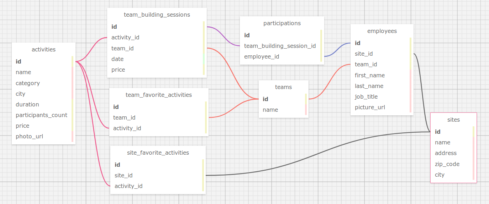

# Feature implementation

Now that you know everything that needs to be done, it's time to really **implement** the new feature, on both the **API** and the **client application**.

## Setup

If you want to **work on the API**, execute the following in the Terminal:

```bash
cd ~/lewagon-workshop/07-team-work/api
code .
```

On the other side, if you want to **work on the client application**, execute the following in the Terminal:

```bash
cd ~/lewagon-workshop/07-team-work/web-app
code .
```

## Exercise

You'll find basically two folders:

- `api/` that contains a working version of the API we've been working on yesterday
- `web-app/` that contains a working version of the client application we've worked on in the past

## About the database

We've already applied the changes to the database. You won't have to update its schema.



## Launching the API and the web app

If you want to launch both the API and the web app at the same time, you'll encounter the following error: `Address already in use - bind(2) for "127.0.0.1" port 4567 (Errno::EADDRINUSE)`

It means that you can only have one application launched on port `4567`. The trick is to launch the second app on a different port.

For instance, to launch the web application:

```bash
cd ~/lewagon-workshop/07-team-work/web-app
ruby app.rb -p 6789
```

And now you can access the web application from [http://localhost:6789](http://localhost:6789)

## Objectives

Feel free to get organized the way you want. You can either **pair-program** everything together or someone could take care of one part of the API while another one would start playing with the client application, etc. It's up to you.

Also note that you can split your work in smaller pieces and commit one small piece at a time.

We expect to have at least the **feature working** on the API side with the corresponding request(s) created in **Postman**.

The feature should be proposed via a **GitHub pull request**.

⚠ **NOTE:** Don't forget to work with **git branches**!

## Hints

You'll need to use an extra SQL query to be able to add a new row (data) within a table.

Here is the generic syntax:

```sql
INSERT INTO table_name (column_name, another_column_name, ....) VALUES ('value1',  'value2', ...);
```

And here is an example to save a new activity:

```sql
INSERT INTO activities (name, category, city, duration, participants_count, price, photo_url) VALUES ('Escape Game - La Ligue Des Gentlemen',  'Adventure',  'Nantes',  60, 6, 90, 'https://laliguedesgentlemen.com/wp-content/uploads/2018/01/lu-920x500-c-center.jpg');
```

Note that you don't need to specify the ID as the primary key will be set by default by the database itself.
